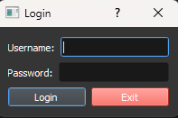
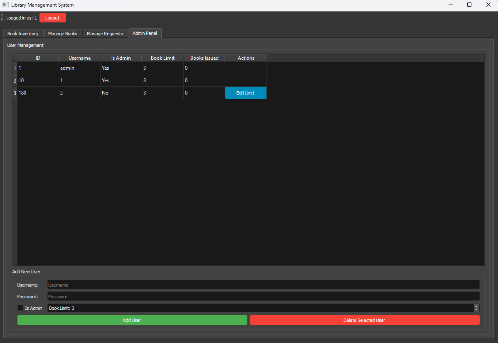
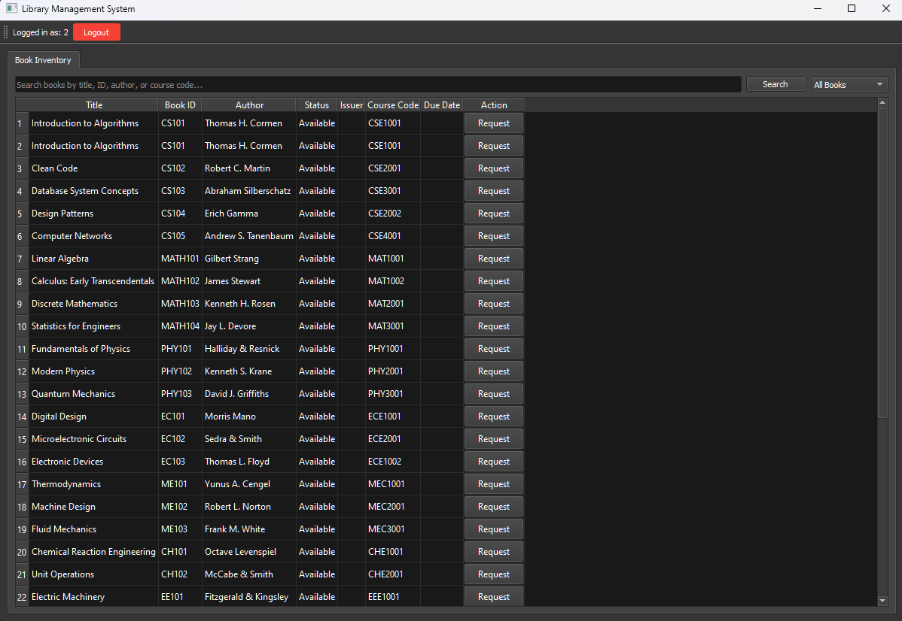
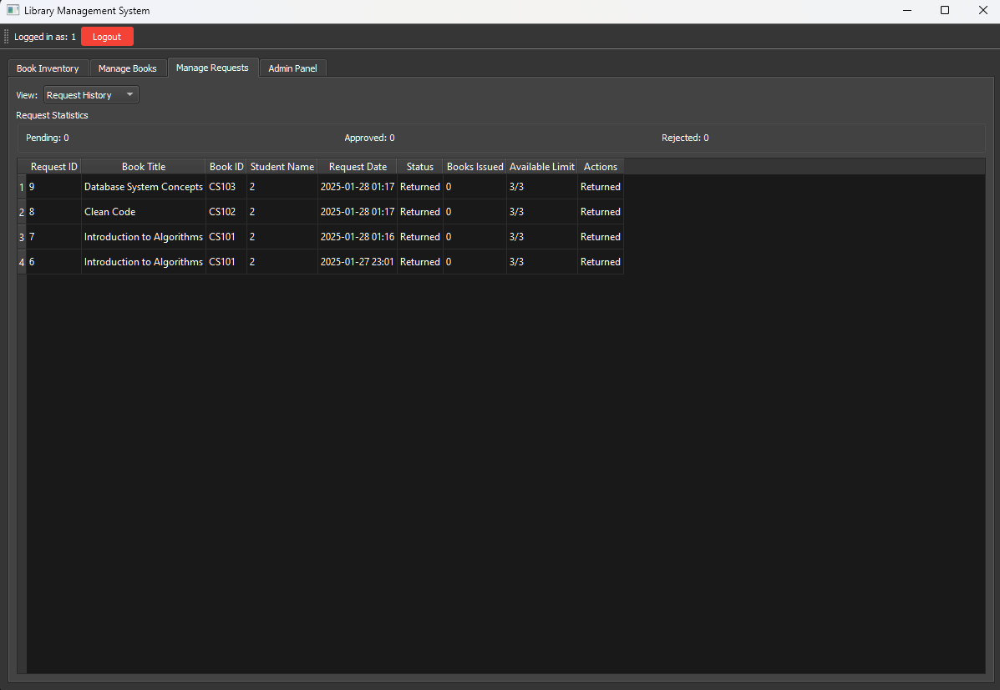

# Library Management System (LMS)

A **Library Management System** built using **PyQt5** and **MySQL**. This application allows users to manage books, handle book requests, and perform administrative tasks such as user management and request approvals.

---

## Features

- **User Authentication**:
  - Login as an **Admin** or **Student**.
  - Admins have full access to manage books, users, and requests.
  - Students can view available books, request books, and check their request status.

- **Book Management**:
  - Add, edit, and delete books.
  - Track book status (Available, Issued).
  - Manage book requests and approvals.

- **User Management**:
  - Admins can add, edit, and delete users.
  - Set book limits for students.

- **Request Management**:
  - Students can request books.
  - Admins can approve or reject requests.
  - Track pending, approved, and rejected requests.

- **Search and Filter**:
  - Search books by title, ID, author, or course code.
  - Filter books by availability or request status.

- **Dark Theme**:
  - The application uses a modern dark theme for better user experience.

---

## Prerequisites

Before running the application, ensure you have the following installed:

1. **Python 3.7+** - [Download Python](https://www.python.org/downloads/)
2. **MySQL Server** - [Download MySQL](https://dev.mysql.com/downloads/mysql/)
3. **PyQt5** - Install via pip:
   ```bash
   pip install PyQt5
   ```
4. **PyMySQL** - Install via pip:
   ```bash
   pip install pymysql
   ```

---

## Installation

1. **Clone the Repository**:
   ```bash
   git clone https://github.com/Kaustubh0912/LMS.git
   cd LMS
   ```

2. **Set Up the Database**:
   - Create a MySQL database named `mydb` (or any name you prefer).
   - Update the database connection details in the `create_db_connection()` function in `LMSv2.py`:
     ```python
     connection = pymysql.connect(
         host='localhost',
         user='root',
         password='your_password',
         database='mydb',
         charset='utf8mb4'
     )
     ```

3. **Run the Application**:
   ```bash
   python LMSv2.py
   ```

---

## Usage

### **Login**
- Use the following credentials to log in:
  - **Admin**:
    - Username: `admin`
    - Password: `admin123`
  - **Student**:
    - Register a new student account via the Admin Panel.

### **Admin Panel**
- **Manage Books**:
  - Add, edit, or delete books.
  - View and manage book requests.
- **Manage Users**:
  - Add, edit, or delete users.
  - Set book limits for students.
- **Request Management**:
  - Approve or reject book requests.

### **Student Panel**
- **View Books**:
  - Search and filter available books.
- **Request Books**:
  - Request books and check request status.

---

## Screenshots

### Login Page


### Admin Panel


### Student Panel


### Request Management


---

## Database Schema

The application uses the following tables:

1. **books**:
   - `id` (Primary Key)
   - `title` (Book Title)
   - `book_id` (Unique Book ID)
   - `author` (Author Name)
   - `status` (Available, Issued)
   - `issuer_id` (User ID of the Issuer)
   - `course_code` (Course Code)
   - `issue_date` (Date of Issue)
   - `return_date` (Date of Return)

2. **users**:
   - `id` (Primary Key)
   - `username` (Unique Username)
   - `password` (Hashed Password)
   - `is_admin` (Boolean: True for Admin, False for Student)
   - `book_limit` (Maximum Books a Student Can Issue)
   - `books_issued` (Number of Books Currently Issued)

3. **book_requests**:
   - `id` (Primary Key)
   - `book_id` (Foreign Key to `books`)
   - `user_id` (Foreign Key to `users`)
   - `status` (Pending, Approved, Rejected)
   - `request_date` (Date of Request)
   - `approval_date` (Date of Approval/Rejection)
   - `notes` (Additional Notes)

---

## Contributing

Contributions are welcome! If you'd like to contribute, please follow these steps:

1. Fork the Project
2. Create your Feature Branch (`git checkout -b feature/AmazingFeature`)
3. Commit your Changes (`git commit -m 'Add some AmazingFeature'`)
4. Push to the Branch (`git push origin feature/AmazingFeature`)
5. Open a Pull Request

---

## License

This project is licensed under the **MIT License**. See the [LICENSE](LICENSE) file for details.

---

## Acknowledgments

- **PyQt5** for the GUI framework.
- **MySQL** for the database backend.
- **PyMySQL** for MySQL database connectivity.

---

Enjoy using the Library Management System! If you have any questions or issues, feel free to open an issue on GitHub.

